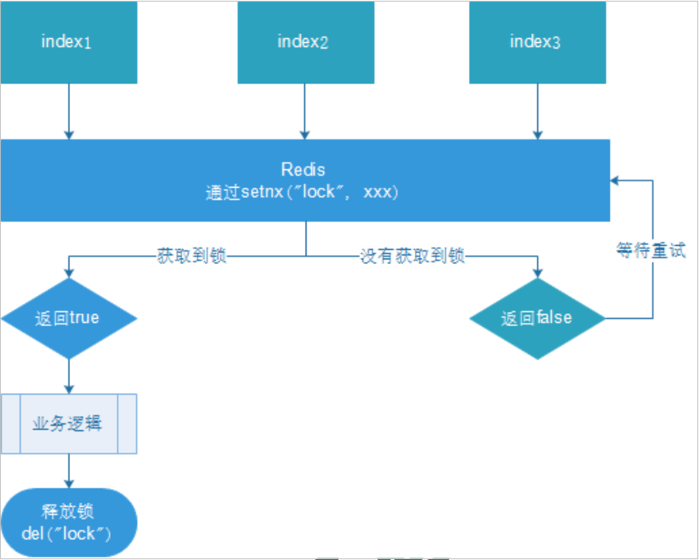
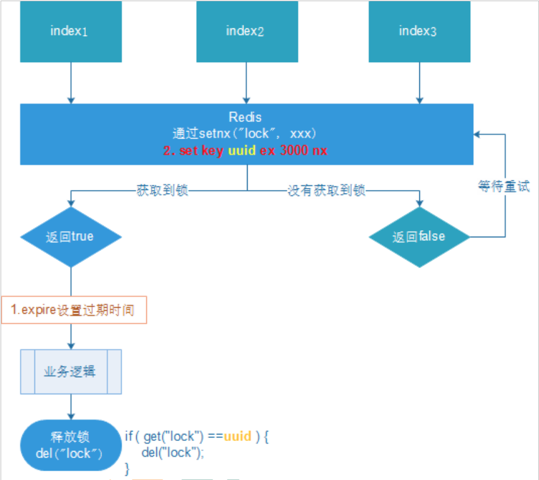

### 14. 分布式锁
* **问题定义**: 随着业务发展的需要，原单体单机部署的系统被演化成分布式集群系统后，由于分布式系统多线程、多进程并且分布在不同机器上，这将使原单机部署情况下的并发控制锁策略失效。  
* **分布式锁主流的实现方案**：  
&emsp;&emsp;(1)基于数据库实现分布式锁  
&emsp;&emsp;(2)基于缓存（Redis等）  
&emsp;&emsp;(3)基于Zookeeper  
* 每一种分布式锁解决方案都有各自的优缺点：  
&emsp;&emsp;(1)性能：redis最高  
&emsp;&emsp;(2)可靠性：zookeeper最高  

#### 14.1 实现方案
```
redis:命令
# set sku:1:info “OK” NX PX 10000
// EX second ：设置键的过期时间为 second 秒。 SET key value EX second 效果等同于 SETEX key second value 。
// PX millisecond ：设置键的过期时间为 millisecond 毫秒。 SET key value PX millisecond 效果等同于 PSETEX key millisecond value 。
// NX ：只在键不存在时，才对键进行设置操作。 SET key value NX 效果等同于 SETNX key value 。  
// XX ：只在键已经存在时，才对键进行设置操作。
```
  

#### 14.2 使用 UUID 优化防止误删除 key 
  
* 如果锁到期自动释放后，获取到锁的进程依然要修改共享变量，为了保证修改的正确性，可以考虑引入版本号或时间戳，在修改前比较版本号或时间戳。
#### 14.3 使用 LUA 脚本保证删除的原子性  
* **问题**：进程 A 在删除操作的时候，正要删除，还没有删除，而此时锁到了过期时间，自动释放了；自动释放后进程 B 持有了锁，此时 B 持有的锁被进程 A 释放了。
* **原因**：删除判断条件if(uuid == get("key"))和 del(key) 不具有原子性。
* **LUA脚本示例**：
* `EVAL script numkeys key [key ...] arg [arg ...]` 命令  
```LUA
if redis.call('GET', KEYS[1]) == ARGV[1] then
    return redis.call('DEL', KEYS[1])
else
    return 0
end

EVAL "if redis.call('GET', KEYS[1]) == ARGV[1] then return redis.call('DEL', KEYS[1]) else return 0 end" 1 key uuid
```
